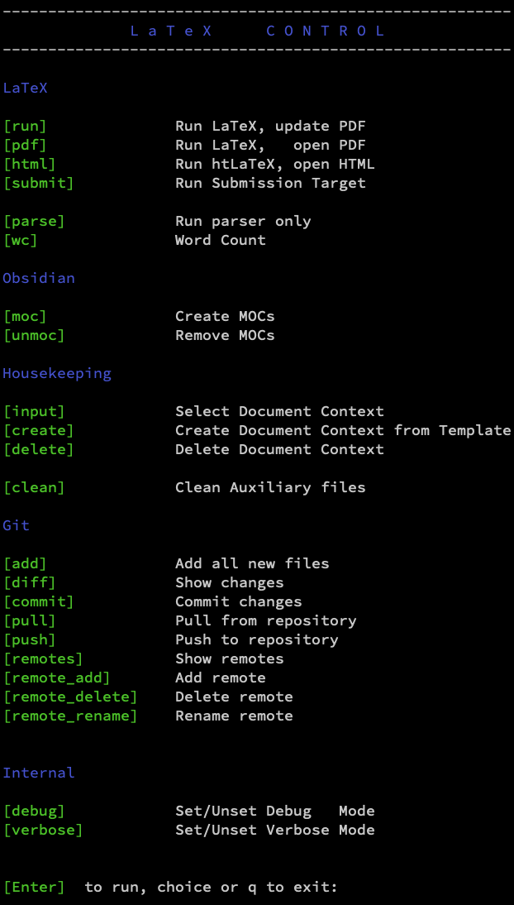

# Basic Usage

## The LaTeX Shell

Open a Bash shell (e.g., GitBash under Windows, if you followed the installation [here](Dissertation/Documentation/README.md)) and change into the directory into which you had cloned the dissertation template:

```bash
cd ~/My\ Documents/dissertation-template
```

Open the Make script:

```bash
./make.sh
```

This will give you a menu such as this:



You can enter any of the commands there, or just press `Enter`, which will run the `run` command. In a typical work cycle, you'd often just have that shell open in a window and hit `Enter` every now and then when you want to re-generate a PDF that you have already open in your PDF viewer.

## Command Line Usage

Instead of using the interface above, you can also control the LaTeX shell from the command line. For example, if you want to first `clean` (remove) LaTeX auxiliary files, and then make a `pdf`, you can run this:

```bash
./make.sh clean pdf
```

